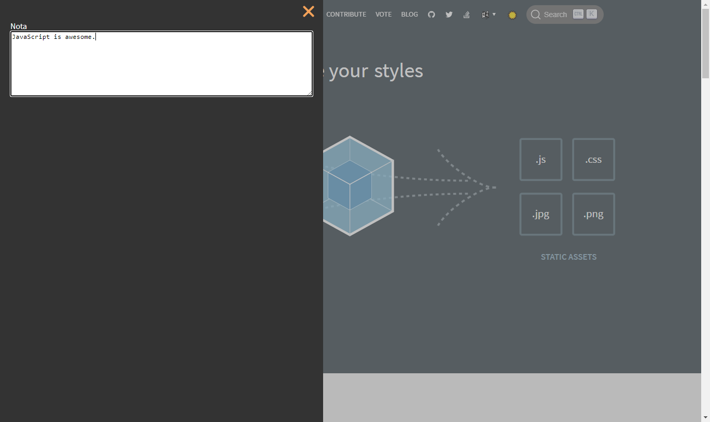

# Nota.

A minimalist note-taking app for the web, URL based.



## Usage

A. Installation

1. Install the [Tampermonkey • Chrome](https://www.tampermonkey.net/) Chrome extension or [Greasemonkey](https://addons.mozilla.org/en-US/firefox/addon/greasemonkey/) for Firefox.
2. Install the userscript [here](https://github.com/yuis-ice/nota/raw/main/userscript/main.user.js).

B. Usage

1. Type "ESC" key (escape key) to toggle the sidebar.
2. Profit.

- Your note will be automatically saved, for every URL. Even with the URL parameters.
- You can see the json data on the "note" column of the domain's local storage.

## Build

```
npm i
npx webpack --config ./config/webpack.config.dev.js
```

## License

This software is released under the GPL-3 license terms.
